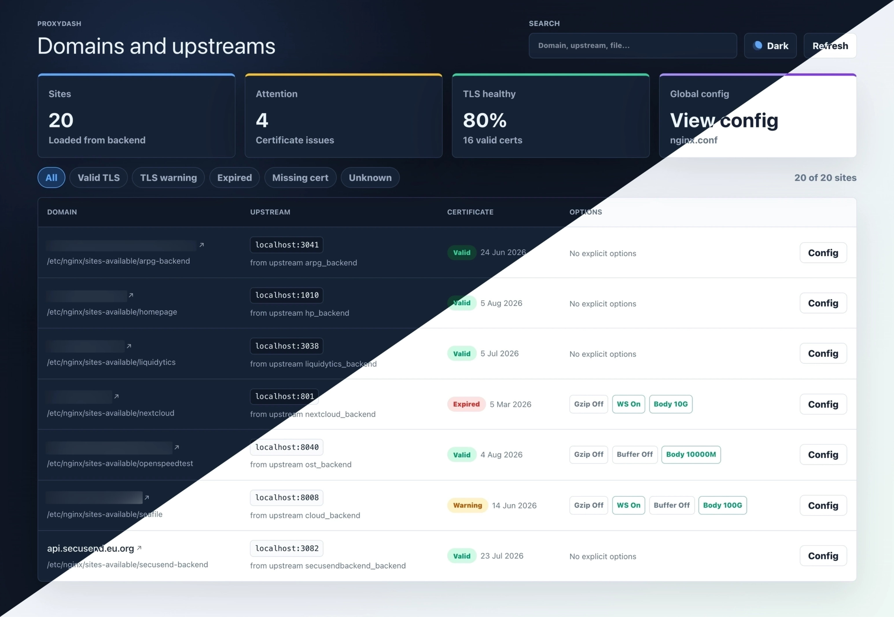
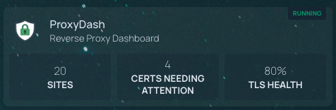

# ProxyDash

[](https://hub.docker.com/r/drarox/proxydash/)
[](https://hub.docker.com/r/drarox/proxydash/)
[](https://github.com/Drarox/proxydash/issues)
[](https://github.com/Drarox/proxydash/pulls)
[](https://github.com/Drarox/proxydash/blob/master/LICENSE)

A lightweight, self-hosted dashboard that gives you a clear view of your Nginx reverse proxy setup.

ProxyDash reads your config files directly and turns them into an easy-to-scan interface, showing all your proxied services, domains, and SSL status in one place. No digging through configs, just a straightforward overview of what’s running and how it’s exposed.

Everything runs in a single service, so it’s simple to deploy and stays out of your way.



---

## Features

- Parses `nginx.conf` and every file in `sites-available` (or `conf.d`)
- Displays domains, proxy targets, SSL/TLS certificate expiry, and proxy options
- Certificate status is cached on startup and refreshed automatically every hour
- Single-binary deployment: one container, one port
- Zero runtime dependencies beyond Bun
- Clean and simple user interface with Light and Dark mode

---

## Quick start

### Docker run

```bash
docker run -d \
  --name proxydash \
  -p 3000:3000 \
  -v /etc/nginx/nginx.conf:/etc/nginx/nginx.conf:ro \
  -v /etc/nginx/sites-available:/etc/nginx/sites-available:ro \
  drarox/proxydash:latest
```

Then open **<http://localhost:3000>**.

---

### Docker Compose (recommended)

```yaml
services:
  proxydash:
    image: drarox/proxydash:latest
    container_name: proxydash
    restart: unless-stopped
    ports:
      - "3000:3000"
    volumes:
      # Volume 1 – main Nginx config file (read-only)
      - /etc/nginx/nginx.conf:/etc/nginx/nginx.conf:ro
      # Volume 2 – sites-available directory (read-only)
      - /etc/nginx/sites-available:/etc/nginx/sites-available:ro
    environment:
      # Optional – override the paths if your Nginx layout differs
      # NGINX_CONFIG_PATH: /etc/nginx/nginx.conf
      # NGINX_SITES_AVAILABLE_DIR: /etc/nginx/conf.d
      # CERT_REFRESH_CRON: 0 * * * *
      # PORT: 3000
```

Save as `docker-compose.yml` and run:

```bash
docker compose up -d
```

---

## Volume reference

| Volume (host → container) | Purpose | Required |
|---|---|---|
| `/etc/nginx/nginx.conf` → `/etc/nginx/nginx.conf` | Main Nginx configuration file | Yes (unless overridden via env) |
| `/etc/nginx/sites-available` → `/etc/nginx/sites-available` | Directory containing per-site config files | Yes (unless overridden via env) |

Both mounts are **read-only** (`:ro`). ProxyDash never writes to your Nginx files.

---

## Environment variables

| Variable | Default | Description |
|---|---|---|
| `PORT` | `3000` | Port the server listens on |
| `NGINX_CONFIG_PATH` | `/etc/nginx/nginx.conf` | Absolute path to the main Nginx config file inside the container |
| `NGINX_SITES_AVAILABLE_DIR` | `/etc/nginx/sites-available` | Absolute path to the directory containing per-site config files inside the container |
| `CERT_REFRESH_CRON` | `0 * * * *` | Cron pattern for automatic cert refresh (every hour by default) |

If your Nginx installation uses non-standard paths (e.g. `/usr/local/nginx/conf`), adjust both the volume mount destination **and** the corresponding environment variable.

---

## API endpoints

The backend exposes a small REST API under `/api`:

| Method | Path | Description |
|---|---|---|
| `GET` | `/api` | Service info and endpoint index |
| `GET` | `/api/health` | Health check + resolved config paths |
| `GET` | `/api/nginx/config` | Raw content of `nginx.conf` |
| `GET` | `/api/nginx/config-files` | Raw content of every file in `sites-available` |
| `GET` | `/api/nginx/sites` | Parsed proxy site list with cached cert status |
| `GET` | `/api/stats` | Stats summary (sites count, certs needing attention, TLS health %) |
| `POST` | `/api/nginx/cert-cache/refresh` | Trigger an immediate cert cache refresh |

---

## Homepage widget

ProxyDash exposes a `/api/stats` endpoint designed for the [Homepage](https://gethomepage.dev) dashboard using the [Custom API widget](https://gethomepage.dev/widgets/services/customapi/).



Add the following to your `services.yaml` in Homepage:

```yaml
- ProxyDash:
    href: http://your-proxydash-host:3000
    description: Reverse Proxy Dashboard
    widget:
      type: customapi
      url: http://your-proxydash-host:3000/api/stats
      refreshInterval: 60000
      mappings:
        - field: sites
          label: Sites
          format: number
        - field: certsNeedingAttention
          label: Certs needing attention
          format: number
        - field: tlsHealthPercent
          label: TLS health
          format: percent
```

Replace `your-proxydash-host:3000` with the actual host and port where ProxyDash is running.

---

## Building locally

Requirements: [Bun](https://bun.sh) ≥ 1.x and Docker.

```bash
# Clone
git clone https://github.com/drarox/proxydash.git
cd proxydash

# Build the image
docker build -t proxydash:local .

# Run against your local Nginx
docker run -d \
  -p 3000:3000 \
  -v /etc/nginx/nginx.conf:/etc/nginx/nginx.conf:ro \
  -v /etc/nginx/sites-available:/etc/nginx/sites-available:ro \
  proxydash:local
```

### Frontend dev server

```bash
cd front
bun install
bun run dev        # Vite dev server on http://localhost:5173
```

### Backend dev server

```bash
cd back
bun install
bun run dev        # Hono server with hot-reload on http://localhost:3000
```

---

## Project structure

```
proxydash/
├── front/               # Vue 3 + Vite + Tailwind CSS frontend
│   └── src/
│       ├── components/  # Dashboard UI components
│       ├── composables/ # useProxySites composable
│       ├── services/    # API client
│       └── types/       # Shared TypeScript types
├── back/                # Bun + Hono backend
│   └── src/
│       ├── index.ts     # Entry point – serves API + static files
│       ├── nginx/       # Nginx config parser & service layer
│       ├── cache/       # In-memory cert cache (read/write/refresh)
│       ├── crons/       # Scheduled jobs (cert refresh via croner)
│       └── utils/       # Low-level TLS certificate check
├── Dockerfile           # Multi-stage production build
└── .dockerignore
```

---

## License

[GPL-3.0 license](https://github.com/Drarox/proxydash/blob/master/LICENSE)
